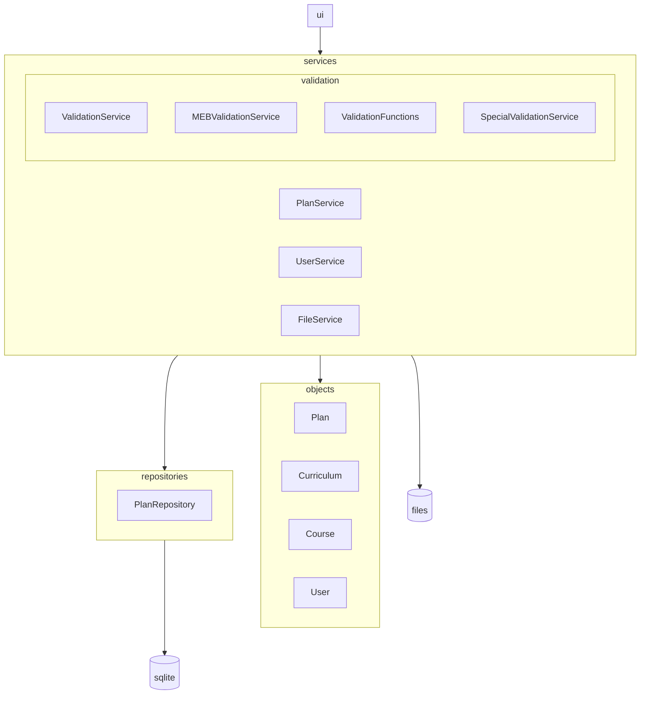
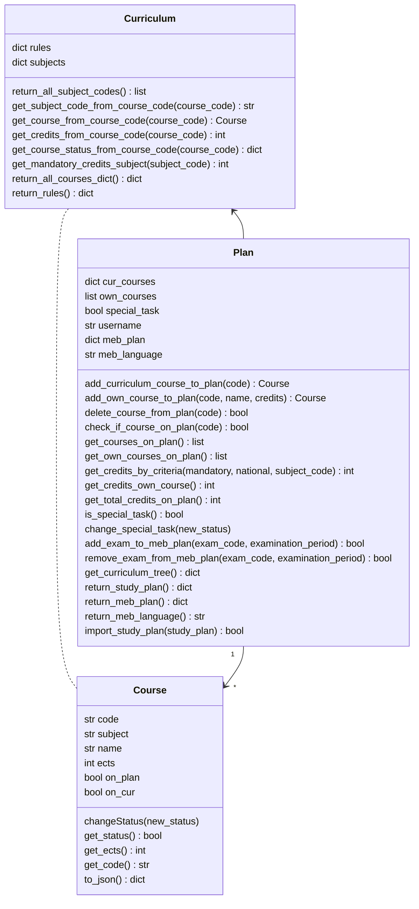
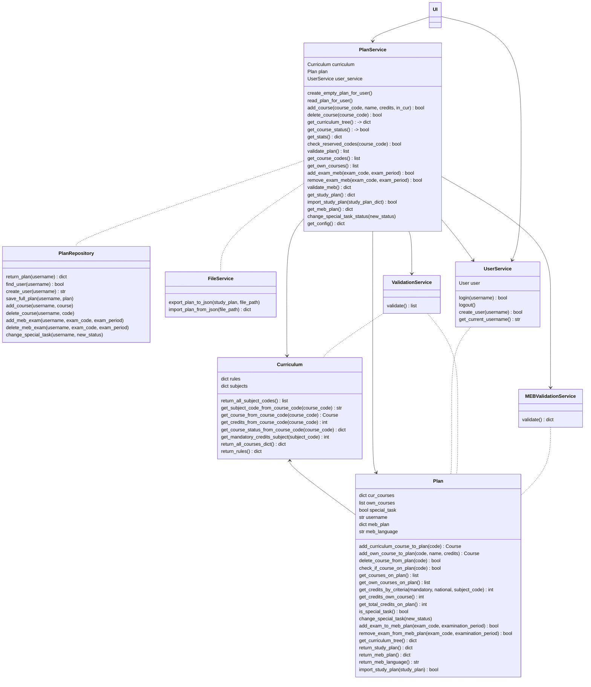
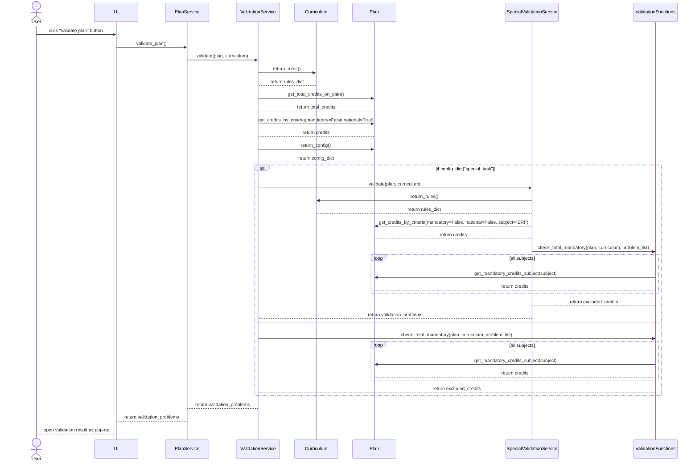
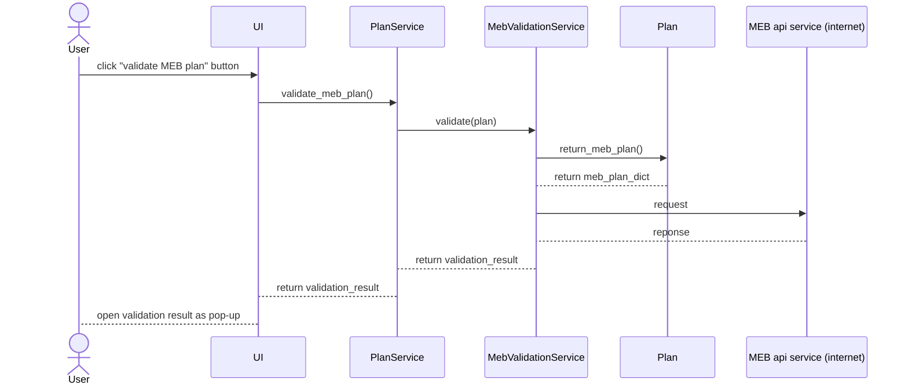

# Arkkitehtuurikuvaus

## Rakenne

Ohjelman rakenne on alla olevan kaavion mukainen:

Käyttöliittymä (_UI_) käyttää tietorakenteita (_Objects_) palveluiden (_Services_) kautta. _Services_ hoitaa siis kaikki sovelluslogiikan tehtävät. Tietokantaoperaatiot toteutetaan _repositories_-luokkien kautta. Tiedostoon kirjoittamiselle on oma _FileService_.

## Käyttöliittymä

Graafisessa käyttöliittymässä on kolme eri päänäkymää:

- Kirjautuminen
- Uuden käyttäjän luonti
- Suunnitelman päänäkymä

Edellä mainituista päänäkymistä ainoastaan yksi on kerrallaan esillä. Suunnitelman päänäkymästä on mahdollista avata pop-up ikkunoita. Jokainen pop-up ikkuna hoitaa oman pienen tehtävän. 

Päänäkymien luomisesta ja hallinnoinnista vastaa [UI](/src/ui/gui/ui.py)-luokka. Päänäkymät löytyvät [_views_](/src/ui/gui/views/)-kansiosta. Suunnitelman päänäkymä muodostuu pienistä [komponenteista](/src/ui/gui/components/). Jokainen komponentti vastaa yhdestä päänäkymän tarjoamasta toiminnallisuudesta. Jokainen komponentti toimii oman "framen" sisällä.

Kun käyttäjä kirjautuu sisälle latautuu tietokannasta aikaisempi versio käyttäjän suunnitelmasta. Näin ollen suunnitelman päänäkymään voidaan esimekiksi LOPS-puuhun valita jo valmiiksi aikaisemmin suunnitellut kurssit.

Käyttöliittymä ei vastaa sovelluslogiikasta. Käyttöliittymä muuttaa esimerkiksi suunnitelmaa [PlanServicen](/src/services/plan_service.py) tarjoamilla metodeilla. Käyttäjänhallinta hoituu puolestaan [UserServicen](/src/services/user_service.py) metodeilla.

Käyttöliittymä tekee kuitenkin eräitä validiointeja. Esimerkiksi käyttöliittymä mahdollistaa ainoastaan yhden YO-aineen valitsemisen samalla kirjoituspäivälle.

## Suunnitelman sovelluslogiikka

### Perustietorakenteet

Opiskelusuunnitelman tietorakenteet muodostaa kolme luokkaa: [Plan](/src/objects/plan.py), [Curriculum](/src/objects/curriculum.py) ja [Course](/src/objects/course.py).

Jokainen opiskelusuunnitelma (_Plan_) luodaan yhden opetussuunnitelman (_Curriculum_) pohjalta. _Plan_-luokan konstruktori lataa kaikki opetussuunnitelman kurssit suorittamattomiksi. _Plan_-luokka huolehtii suunnitelman tietojen tallentamisesta. Näitä on esimerkiksi kurssien suoritusteidot, YO-suunnitelma ja konfigurointitiedot.
Kurssitietoja varten on _Course_-luokka. Se vastaa kaikilla kursseilla tiedosta onko kurssi osa suunnitelmaa. Käyttäjän omilla kursseilla se myös vastaa kurssin nimestä ja opintopistemäärästä.

Opetussuunnitelma vastaa siihen kuuluvien kurssien tiedoista, kuten pakollisuus, opintopistemäärä ja oppiaine. Käyttäjän omien kurssien tapauksessa tämä tehtävä on _Course_-luokalla.

### Opintosuunnitelman hallinta

[PlanService](/src/services/plan_service.py) vastaa opintosuunnitelman hallinnasta. 

_PlanService_-luokalla on tallennettuna viittaus yhteen _Plan_-objektiin. Tämä objekti joko luodaan `create_empty_plan_for_user`-funktiolla tai ladataan tietokannasta `read_plan_for_user`-funktiolla. Kaikki suunnitelmaa muuttavat funktio vaativat, että käyttäjä on kirjautuneena sisälle. _PlanService_ tarkistaa tämän _UserService_:ltä. 

_PlanService_ muokkaa suunnitelmaa _Plan_-objektin tarjoamilla funktioilla. _PlanService_ tekee tässä välissä muutamia validiointeja. _PlanService_ palauttaa myös tilastoja ja tietoja suunnitelmasta. _PlanServicen_ kautta tapahtuu myös suunnitelman validiointi.

### Suunnitelman tallentaminen tiedostoon tai tietokantaan

Jokaisella suunnitelman muokkauskutsulla _PlanService_ tekee kaksi asiaa: välittää tehtävän _Plan_-objektille ja mikäli muokkaus onnistuu, tekee vastaavan kutsun [PlanRepository](/src/repositories/plan_repository.py)-luokalle. _PlanRepository_-luokka huolehtii suunnitelman tallentamisesta tietokantaan. Tallentaminen tapahtuu `sqlitedict` moduulilla. Tämä moduuli antaa työkalut muokata _sqlite_-tietokantaa samoilla komennoilla kuin pythonin _dict_-objektia.

_PlanRepository_-luokka tarjoaa myös mahdollisuuden ladata kokosuunnitelman tietokannasta. Tätä käytetää _PlanServicen_ funktion `read_plan_for_user` yhteydessä. Tietokannan alustaminen tapahtuu invoke tehtävällä.

Suunnitelman voi tallentaa myös JSON-tiedostoon. Tämän hoitaa [FileService](/src/services/file_service.py)-luokka. Tiedostoon tallentaminen tapahtuu vain käyttäjän toiveesta, joten siitä vastaa eri luokka.

## Validioinnin sovelluslogiikka

Sovelluksessa on kaksi erilaista validiointia. Opiskelusuunnitelman validioinnista vastaa [ValidationService](/src/services/validation/validation_service.py). YO-suunnitelman validioinnille on oma [MEBValidationService](/src/services/validation/meb_validation_service.py).

### Opiskelusuunnitelman validiointi

Opiskelusuunnitelman validiointia varten _ValidationService_-luokka tarjoaa funktion `validate`. Funktio ottaa argumenteiksi _Plan_ ja _Curriculum_ -objektit. Validioinnin säännöt saadaan _Curriculum_ -objektista. _Plan_-objekti palauttaa puolestaan validioinnin vaatimat tiedot opintopisteistä ja suunnitelman konfiguraatiosta.

Validiointi tarkistaa seuraavat asiat:
- Suunnitelmalla on yhteensä tarpeeksi opintopisteitä
- Suunnitelmalla on tarpeeksi valtakunnallisia valinnaisia opintopisteitä
- Suunnitelmaan kuuluu kaikki pakolliset opintopisteet (tämän toiminnallisuuden yksityiskohdat riippuvat suunnitelman tyypistä)

Suunnitelmalla on kaksi mahdollista tyyppiä: normaali suunnitelma ja erityistehtäväsuunnitelma. Erityistehtäväsuunnitelmaa varten pakollisten opintopisteiden tarkastaminen tehdään luokan [SpecialValidationService](/src/services/validation/special_validation_service.py) kautta. Tämä luokka tarkistaa ensiksi, että löytyykö tarpeeksi erityistehtäväopintopisteitä, jotta poislukuoikeus voidaan ansaita. Tämän jälkeen pakolliset opintopisteet tarkistetaan seuraavilla ehdoilla:
- Jokaisesta oppiaineesta täytyy suorittaa vähintään puolet pakollisista opintopisteistä.
- Yhteensä puuttuvia pakollisia opintopisteitä saa olla opetusuunnitelman säännön `maximum_excluded_credits_special_task` määrittämä määrä. 

Normaalin suunnitelman pakolliset opintopisteet tarkistetaan luokan _ValidationService_-toimesta. Molemmat tavat hyödyntävät luokan [ValidationFunctions](/src/services/validation/validation_functions.py) funktioita pakollisten opintopisteiden laskemiseen. 

Lopuksi _ValidationService_ palauttaa validoinnin tulokset _dict_-objektina. Käyttöliittymä tulostaa tulokset ihmisluettavassa muodossa.

### YO-suunnitelman validiointi

YO-suunnitelma validioidaan _MebValidationService_ luokan `validate`-funktiolla. Funktio tekee kaksi erilaista tarkistusta:
- Funktio tarkistaa paikallisesti, että suunnitelmalle ei ole valittu kahta tai useampaa koetta samalle koepäivälle.
- Tutkinnon rakenne tarkistetaan Ylioppilastutkintolautakunnan [palvelun](https://ilmo.ylioppilastutkinto.fi/v1/api-docs/) avulla.

Validoinnin tulokset palautetaan _dict_-objektina. Käyttöliittymä tulostaa tulokset ihmisluettavassa muodossa.

