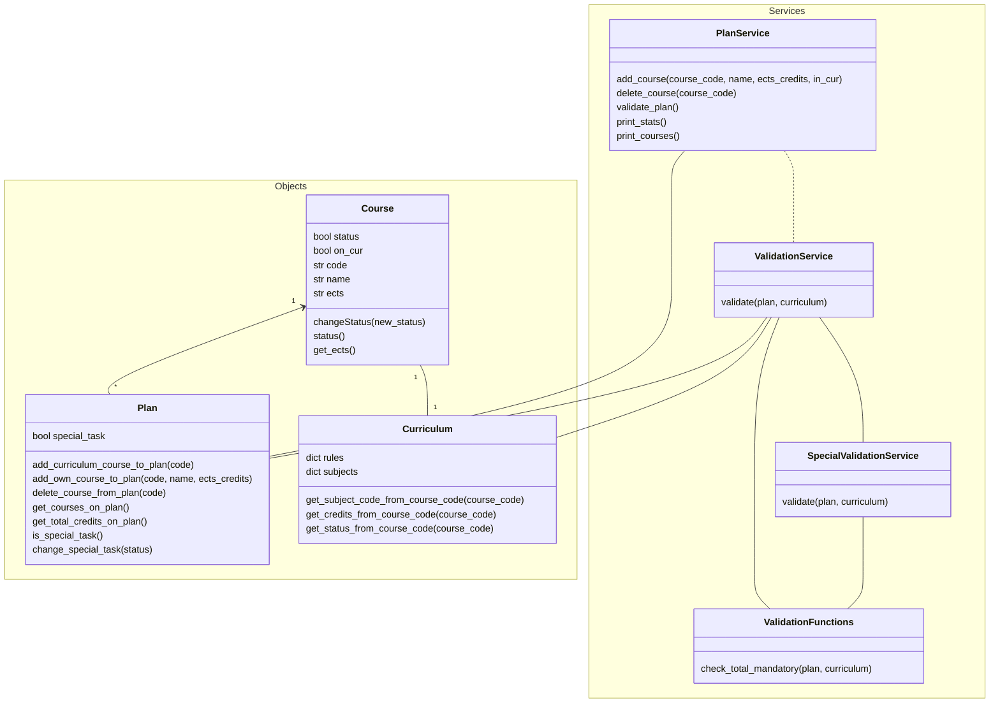

# Arkkitehtuurikuvaus

**EDIT**: Jostain syystä luokkakaavio ei näy GitHubissa, vaikka se näkyy VSCoden esikatselussa🤷‍♂️

```mermaid
classDiagram
    namespace Objects {
        class Course {
            bool status
            bool on_cur
            str code
            str name
            str ects
            changeStatus(new_status)
            status()
            get_ects()
        }
        class Plan {
            bool special_task
            add_curriculum_course_to_plan(code)
            add_own_course_to_plan(code, name, ects_credits)
            delete_course_from_plan(code)
            get_courses_on_plan()
            get_total_credits_on_plan()
            is_special_task()
            change_special_task(status)
        }
        class Curriculum {
            dict rules
            dict subjects
            get_subject_code_from_course_code(course_code)
            get_credits_from_course_code(course_code)
            get_status_from_course_code(course_code)
        }
    }
    Course "1" <-- "*" Plan
    Course "1" -- "1" Curriculum
    namespace Services {
        class PlanService {
            add_course(course_code, name, ects_credits, in_cur)
            delete_course(course_code)
            validate_plan()
            print_stats()
            print_courses()
        }
        class ValidationService {
            validate(plan, curriculum)
        }
        class ValidationFunctions {
            check_total_mandatory(plan, curriculum)
        }
        class SpecialValidationService {
            validate(plan, curriculum)
        }
    }
    ValidationService -- SpecialValidationService
    ValidationService -- ValidationFunctions
    SpecialValidationService -- ValidationFunctions
    PlanService .. ValidationService
    PlanService -- Plan
    ValidationService -- Plan
    ValidationService -- Curriculum
```
