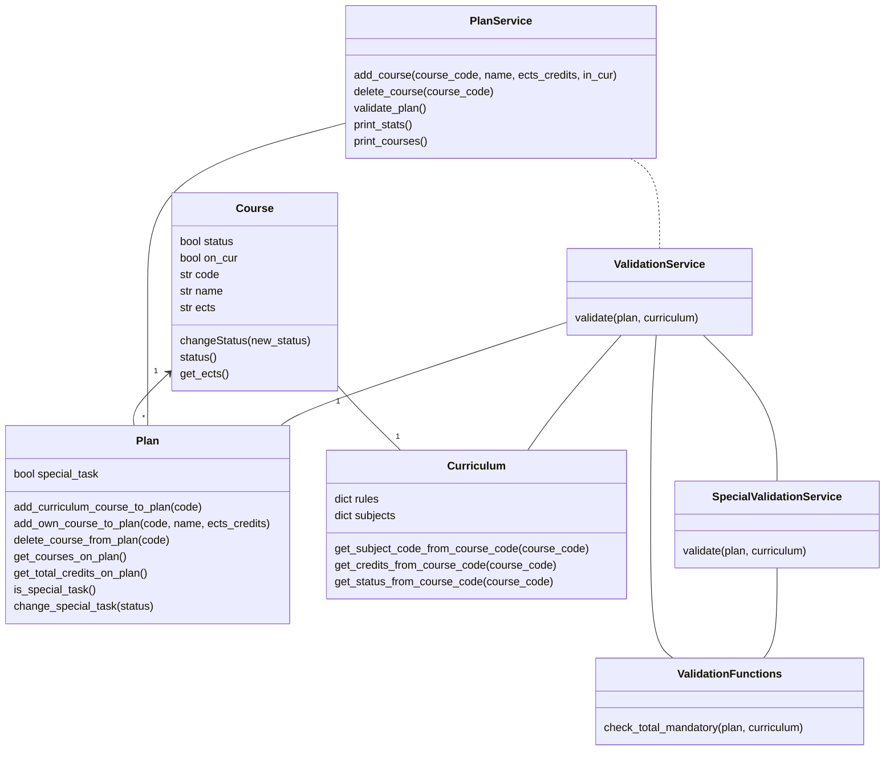
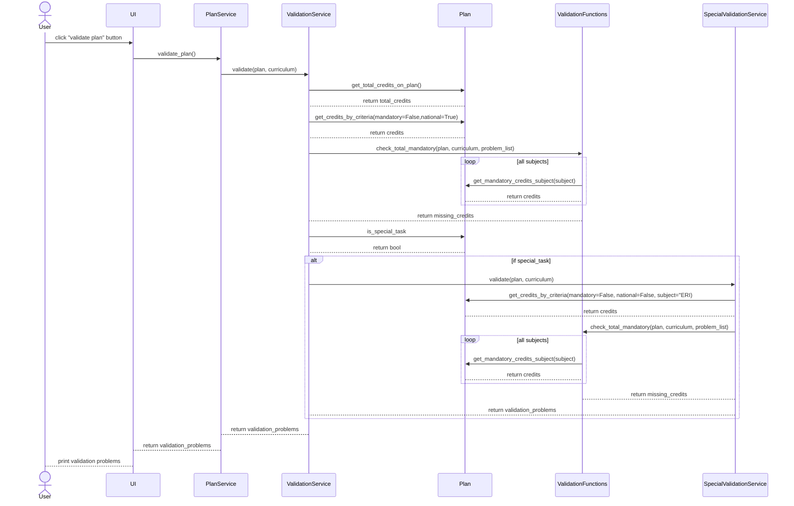

# Arkkitehtuurikuvaus

## Luokat

```mermaid
classDiagram
        class Course {
            bool status
            bool on_cur
            str code
            str name
            str ects
            changeStatus(new_status)
            status()
            get_ects()
        }
        class Plan {
            bool special_task
            add_curriculum_course_to_plan(code)
            add_own_course_to_plan(code, name, ects_credits)
            delete_course_from_plan(code)
            get_courses_on_plan()
            get_total_credits_on_plan()
            is_special_task()
            change_special_task(status)
        }
        class Curriculum {
            dict rules
            dict subjects
            get_subject_code_from_course_code(course_code)
            get_credits_from_course_code(course_code)
            get_status_from_course_code(course_code)
        }
    Course "1" <-- "*" Plan
    Course "1" -- "1" Curriculum
        class PlanService {
            add_course(course_code, name, ects_credits, in_cur)
            delete_course(course_code)
            validate_plan()
            print_stats()
            print_courses()
        }
        class ValidationService {
            validate(plan, curriculum)
        }
        class ValidationFunctions {
            check_total_mandatory(plan, curriculum)
        }
        class SpecialValidationService {
            validate(plan, curriculum)
        }
    ValidationService -- SpecialValidationService
    ValidationService -- ValidationFunctions
    SpecialValidationService -- ValidationFunctions
    PlanService .. ValidationService
    PlanService -- Plan
    ValidationService -- Plan
    ValidationService -- Curriculum
```

## Toiminnallisuudet

### Validiointi

```mermaid
sequenceDiagram
actor User
participant UI
User ->> UI: click "validate plan" button
participant PlanService
UI ->> PlanService: validate_plan()
participant ValidationService
PlanService ->> ValidationService: validate(plan, curriculum)
participant Plan
ValidationService ->> Plan: get_total_credits_on_plan()
Plan --> ValidationService: return total_credits
ValidationService ->> Plan: get_credits_by_criteria(mandatory=False,national=True)
Plan --> ValidationService: return credits
participant ValidationFunctions
ValidationService ->> ValidationFunctions: check_total_mandatory(plan, curriculum, problem_list)
loop all subjects
    ValidationFunctions ->> Plan: get_mandatory_credits_subject(subject)
    Plan --> ValidationFunctions: return credits
end
ValidationFunctions --> ValidationService: return missing_credits
ValidationService ->> Plan: is_special_task
Plan --> ValidationService: return bool
alt if special_task
    participant SpecialValidationService
    ValidationService ->> SpecialValidationService: validate(plan, curriculum)
    SpecialValidationService ->> Plan: get_credits_by_criteria(mandatory=False, national=False, subject="ERI)
    Plan --> SpecialValidationService: return credits
    SpecialValidationService ->> ValidationFunctions: check_total_mandatory(plan, curriculum, problem_list)
    loop all subjects
        ValidationFunctions ->> Plan: get_mandatory_credits_subject(subject)
        Plan --> ValidationFunctions: return credits
    end
    ValidationFunctions --> SpecialValidationService: return missing_credits
    SpecialValidationService --> ValidationService: return validation_problems
end
ValidationService --> PlanService: return validation_problems
PlanService --> UI: return validation_problems
UI --> User: print validation problems

```