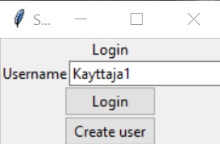
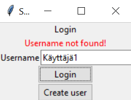
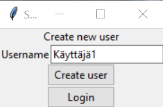
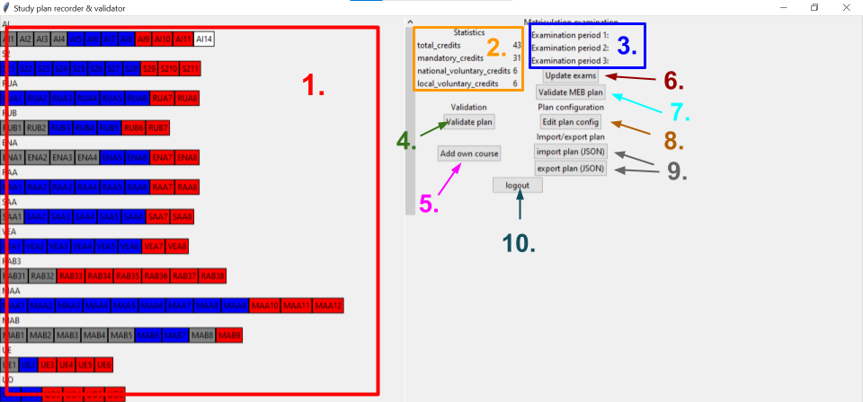
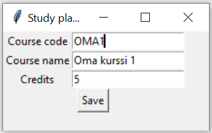
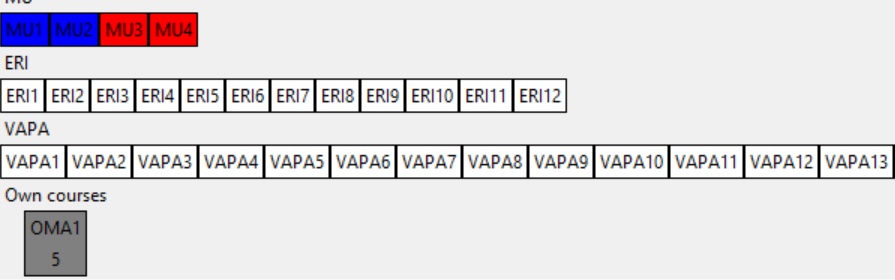
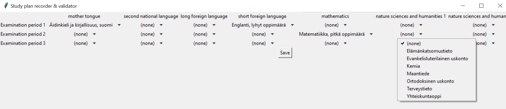

# Käyttöohje

## Konfigurointi
Konfigurointi tiedot määritetään _.env_-tiedostossa. Tiedosto sijoitetaan _config_-hakemistoon. Seuraavat ympäristömuuttujat on mahdollista määrittää:

`DATABASE_FILENAME`: Tietokannan nimi. Tietokanta luodaan automaattisesti _data_-hakemistoon.

`MAX_MEB_PERIODS`: Monellako peräkkäisellä kirjoituskerralla YO-tutkinto täytyy suorittaa. Toistaseksi määräyksenä on 3 kirjoituskertaa.

`CURRICULUM_FILENAME`: Tiedosto, josta opetussuunnitelma ladataan. Tiedoston täytyy olla JSON-muotoinen ja noudattaa [muoto-ohjeita](opetussuunnitelma_ohje.md).

`MEB_EXAM_CODES_FILENAME`: Tiedosto, josta ladataan YO-tutkinnon kokeiden tiedot. Tiedoston täytyy olla muotoa:

```
KOODI;FI;SV;EN;DAY;EXAM_LANGUAGE
BI;Biologia;Biologi;Biology;7;BOTH
...
```


`MEB_EXAM_DAYS_FILENAME`: Tiedosto, josta ladataan YO-tutkinnon päivien tiedot. Tiedoston täytyy olla muotoa:

```
DAY;FI;SV;EN
1;äidinkieli;modersmål;mother tongue
...
```

> [!IMPORTANT]
> Jotta ohjelma toimisi, täytyy _config_-hakemistosta löytyä yllä mainitut tiedostot _curriculum.json_, _meb_exam_codes.csv_ ja _meb_exam_days.csv_.

## Ohjelman käynnistäminen

1. Riipuvuudet täytyy asentaa komennolla:
```
poetry install
```

2. Alustustoimnepiteet ajetaan komennolla:
```
poetry run invoke build
```

3. Graafisen käyttöliittymän saa käynnistettyä komennolla:
```
poetry run invoke start
```

## Kirjautuminen

> [!CAUTION]
> Sovellus ei osaa vielä toimia epäkelpojen syötteiden kanssa. Nämä voivat kaataa ohjelman.

Sovellus kysyy aluksi käyttäjätunnusta.



Syöttämällä käyttäjätunnuksen ja klikkaamalla "Login"-painiketta, pääsee sisälle.

Mikäli käyttäjätunnusta ei ole olemassa, näyttää ohjelma virheilmoituksen.



Uuden käyttäjän voi luoda "Create user"-näkymässä. Uusi käyttäjä luodaan antamalla käyttäjätunnus ja klikkaamalla "Create user"-painiketta. Mikäli käyttäjä luodaan onnistuneesti, kirjautuu ohjelma automaattisesti sisälle.



## Suunnitelmanäkymä

Alla on kuva ohjelman päänäkymästä.



Näkymästä löytyy seuraavat toiminnallisuudet:
1. LOPS-puu, josta voi klikkaamalla valita kursseja osaksi suunnitelmaa.
2. Tilastoja suunnitelmasta.
3. YO-suunnitelma - kokeet ilmestyy koekoodeina.
4. Suunnitelman validiointi. Validioinnin tulos ilmestyy napin alle.
5. Omien kurssien lisääminen. Nappia painamalla ilmestyy näkymä omien kurssien lisäämiseksi.
6. YO-suunnitelman päivittäminen. Nappia painamalla ilmestyy näkymä YO-suunnitelman päivittämiseksi.
7. YO-suunnitelman validiointi. Validioinnin tulos ilmestyy napin alle.
8. Suunnitelman konfiguraatioiden muuttaminen. Toistaiseksi mahdollisuutena on muuttaa suunnitelma noudattamaan erityistehtävän tuntijakoa.
9. Suunnitelman vienti/tuonti JSON-tiedostoon. Nappia painamalla avautuu näkymä tiedoston avaamiseen/tallentamiseen.
10.  Uloskirjautuminen.

## Omien kurssien lisääminen

> [!CAUTION]
> Sovellus ei osaa vielä toimia epäkelpojen syötteiden kanssa. Nämä voivat kaataa ohjelman.

Omia kursseja pystyy lisäämään klikkaamalla "Add own course"-painiketta. Tällöin avautuu alla olevan kuvan mukainen ikkuna.



Täyttämällä tiedot ja klikkaamalla "Save"-painiketta kurssi tallentuu suunnitelmaan.

Omat kurssit ilmestyvät LOPS-puun loppuun niin kutsuttuina häntäkursseina. Oman kurssin saa poistettua suunnitelmasta klikkaamalla kurssikoodia.



## YO-suunnitelman muokkaaminen

YO-suunnitelmaa pääsee muokkaamaan klikkaamalla "Update exams"-painiketta.

Muokkausnäkymästä löytyy taulukko kirjoitettavista kokeista. Vaakariveillä on kirjoituskerrat ja pystyriveillä on eri päivien kokeet. Vetovalikosta saa valittua haluamansa kokeen.

