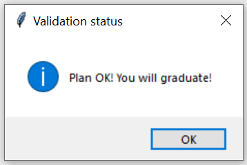
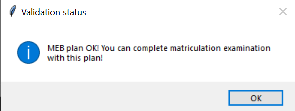
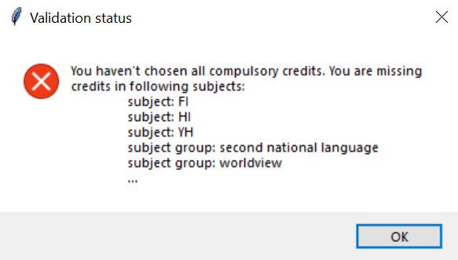
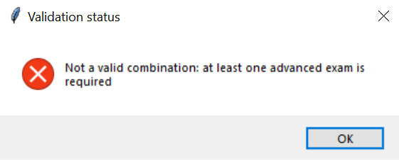
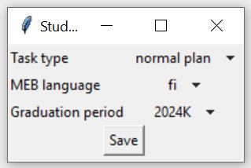

# Käyttöohje

## Konfigurointi
Konfigurointi tiedot määritetään _.env_-tiedostossa. Tiedosto sijoitetaan _config_-hakemistoon. Seuraavat ympäristömuuttujat on mahdollista määrittää:

`DATABASE_FILENAME`: Tietokannan nimi. Tietokanta luodaan automaattisesti _data_-hakemistoon.

`MAX_MEB_PERIODS`: Monellako peräkkäisellä kirjoituskerralla YO-tutkinto täytyy suorittaa. Toistaseksi määräyksenä on 3 kirjoituskertaa.

`CURRICULUM_FILENAME`: Tiedosto, josta opetussuunnitelma ladataan. Tiedoston täytyy olla JSON-muotoinen ja noudattaa [muoto-ohjeita](opetussuunnitelma_ohje.md).

`MEB_EXAM_CODES_FILENAME`: Tiedosto, josta ladataan YO-tutkinnon kokeiden tiedot. Tiedoston täytyy olla muotoa:

```
KOODI;FI;SV;EN;DAY;EXAM_LANGUAGE
BI;Biologia;Biologi;Biology;7;BOTH
...
```


`MEB_EXAM_DAYS_FILENAME`: Tiedosto, josta ladataan YO-tutkinnon päivien tiedot. Tiedoston täytyy olla muotoa:

```
DAY;FI;SV;EN
1;äidinkieli;modersmål;mother tongue
...
```

> [!IMPORTANT]
> Jotta ohjelma toimisi, täytyy _config_-hakemistosta löytyä yllä mainitut tiedostot _curriculum.json_, _meb_exam_codes.csv_ ja _meb_exam_days.csv_.

> [!CAUTION]
> YO-tutkintoon liittyviä konfiguraatiotietoja ei pidä muuttaa, ellei Ylioppilastutkintolautakunta muuta tutkinnon [määräyksiä](https://www.ylioppilastutkinto.fi/fi/tutkinnon-toimeenpano/maaraykset-ja-ohjeet). Mikäli konfiguraatioita muutetaan, antaa YO-suunnitelman validiointi virheellisiä tuloksia. Esimerkiksi nykyisten määräysten mukaan fysiikkaa ja biologiaa ei voi suorittaa samalla tutkintokerralla.


## Ohjelman käynnistäminen

1. Riipuvuudet täytyy asentaa komennolla:
```
poetry install
```

2. Alustustoimnepiteet ajetaan komennolla:
```
poetry run invoke build
```

3. Graafisen käyttöliittymän saa käynnistettyä komennolla:
```
poetry run invoke start
```

## Kirjautuminen

Sovellus kysyy aluksi käyttäjätunnusta.


Syöttämällä käyttäjätunnuksen ja klikkaamalla "Login"-painiketta, pääsee sisälle.

Mikäli käyttäjätunnusta ei ole olemassa, näyttää ohjelma virheilmoituksen.


Uuden käyttäjän voi luoda "Create user"-näkymässä. Uusi käyttäjä luodaan antamalla käyttäjätunnus ja klikkaamalla "Create user"-painiketta. Mikäli käyttäjä luodaan onnistuneesti, kirjautuu ohjelma automaattisesti sisälle.


## Ohjelman toiminnallisuudet

Alla on kuva ohjelman päänäkymästä.


Näkymästä löytyy seuraavat toiminnallisuudet:
1. LOPS-puu, josta voi klikkaamalla valita kursseja osaksi suunnitelmaa.
2. Tilastoja suunnitelmasta.
3. YO-suunnitelma - kokeet ilmestyy koekoodeina.
4. Suunnitelman validiointi. Validioinnin tulos ilmestyy ruudulle.
5. Omien kurssien lisääminen. Nappia painamalla ilmestyy näkymä omien kurssien lisäämiseksi.
6. YO-suunnitelman päivittäminen. Nappia painamalla ilmestyy näkymä YO-suunnitelman päivittämiseksi.
7. YO-suunnitelman validiointi. Validioinnin tulos ilmestyy ruudulle.
8. Suunnitelman konfiguraatioiden muuttaminen. Nappia painamalla ilmestyy näkymä konfiguraatioiden muuttamiseksi.
9. Suunnitelman vienti/tuonti JSON-tiedostoon. Nappia painamalla avautuu näkymä tiedoston avaamiseen/tallentamiseen.
10.  Uloskirjautuminen.

### Opiskelusuunnitelman muokkaaminen

Opetussuunnitelman kautta ladattuja kursseja voi valita LOPS-puusta. Klikkaamalla kurssin nimeä, kurssi lisätään suunnitelmaan. 

Kursseja on neljää eri väriä:

__Sininen__: Kurssi on valtakunnallinen pakollinen

__Punainen__: Kurssi on valtakunnallinen valinnainen

__Valkoinen__: Kurssi on koulukohtainen

__Harmaa__: Kurssi on jo valittu suunnitelmaan


### Omien kurssien lisääminen

Omia kursseja pystyy lisäämään klikkaamalla "Add own course"-painiketta. Tällöin avautuu alla olevan kuvan mukainen ikkuna.


Täyttämällä tiedot ja klikkaamalla "Save"-painiketta kurssi tallentuu suunnitelmaan.

Omat kurssit ilmestyvät LOPS-puun loppuun niin kutsuttuina häntäkursseina. Oman kurssin saa poistettua suunnitelmasta klikkaamalla kurssikoodia.


### YO-suunnitelman muokkaaminen

YO-suunnitelmaa pääsee muokkaamaan klikkaamalla "Update exams"-painiketta.

Muokkausnäkymästä löytyy taulukko kirjoitettavista kokeista. Vaakariveillä on kirjoituskerrat ja pystyriveillä on eri päivien kokeet. Vetovalikosta saa valittua haluamansa kokeen.


### Suunnitelmien validiointi

Opiskelusuunnitelman ja YO-suunnitelman validioineille on omat painikkeet. 

Klikkaamalla painiketta näytölle ilmestyy validiointitulos uudessa ikkunassa. Validiointi tulos kertoo mikäli suunnitelma vaatii korjaamista.

 

Suunnitelmien validiointi on mennyt yllä olevissa kuvissa läpi.

 

Suunnitelmien validiointi puolestaan epäonnistui yllä olevissa kuvissa. Validiointi tulos kertoo mitä pitäisi muuttaa.

### Suunnitelman konfiguraation muuttaminen

Suunnitelman asetuksia/konfiguraatiota pääsee muokkaamaan klikkaamalla "Edit plan config"-painiketta.

Asetuksista voi muuttaa seuravia tietoja:

__Suunnitelman tyyppi__: Noudattaako suunnitelma normaalia lukion tuntijakoa vai eritysitehtävä tuntijakoa.

__YO-tutkinnon kieli__: Millä kielellä YO-tutkinto suoritetaan. Tämä vaikuttaa tarjolla oleviin kokeisiin.

__Valmistumisajankohta__: Milloin tutkinto valmistuu. Mikäli valmistumisajankohta on valittu, näkyy tutkintoperiodien tunnukset YO-suunnitelmassa.


