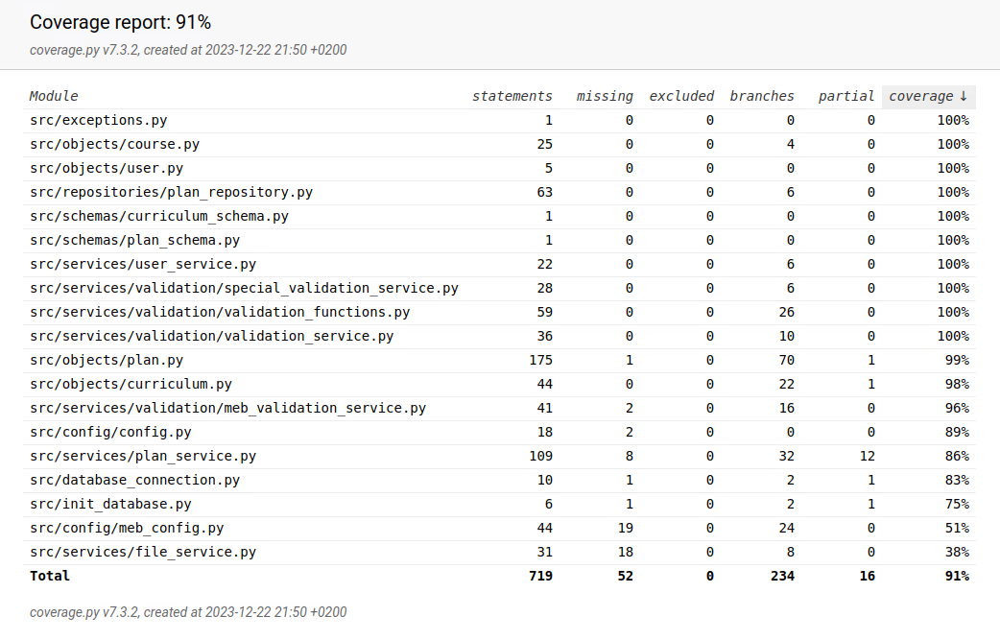

# Testausdokumentti

Sovelluslogiikan testaus on hoidettu automatisoiduin yksikkö- ja integraatiotestein hyödyntäen Pythonin `unittest`-kirjastoa. Käyttöliittymä ja tiedostojen tallennus on testattu manuaalisesti.

## Yksikkö- ja integraatiotestaus

### Yksikkötestaus

Hakemistosta [tests_objects](/src/tests/test_objects/) löytyy testit jokaiselle perustietorakenteelle. Testeistä löytyy sekä oikeita että vääriä argumentteja kokeilevia tapauksia. Yksikkötestien alussa alustetaan valmiiksi testattava objekti. Näin ollen yksikkötestien ideana on ainoastaan testata perustietorakenteiden funktioita, ei niiden luomista.

### Integraatiotestaus

Hakemistosta [tests_services](/src/tests/test_services/) puolestaan löytyy palveluluokkien testit. Näissä testeissä testataan laajemmin eri luokkien toimintaa yhdessä. Esimerkiksi `PlanService`-luokkaa testataan laajasti [TestPlanService](/src/tests/test_services/plan_service_test.py)-testiluokalla. Nämä testit käyvät läpi suunnitelman muokkaamista sekä sallituille että kielletyillä syötteillä. Samalla testataan, että suunnitelma tallentuu tietokantaan. Testitietokannan nimi on konfiguroitu _.env.test_-tiedostoon.

[TestValidationService](/src/tests/test_services/validation_service_test.py)-testiluokka testaa suunnitelman validioinnin toimintaa. Testeissä käydään läpi monia eri poikkeustapauksia sallituitsa ja kielletyistä suunnitelmista. 

> [!IMPORTANT]
> [TestMebPlan](/src/tests/test_services/matriculation_examination_test.py) luokan testit menevät läpi ainoastaan internetyhteyden avulla.

### Testikattavuus

Sovelluksen testikattavuus on 91%. Testikattavuuteen ei ole laskettu käyttöliittymää.

Testaamatta jää muun muassa konfigurointiin ja tietokantoihin liittyviä funktiota. Tämän lisäksi `PlanService`-luokasta jää testaamatta tapaukset, joissa käyttäjä ei ole kirjautunut sisälle, koska käyttöliittymässä ei pääse `PlanService` luokaa käyttämään ilman sisäänkirjautumista.

## Manuaaliset testit

### Asennus ja konfigurointi

Sovelluksen asentaminen ja konfigurointi on testattu manuaalisesti. Sovelluksen suorittaminen onnistuu Cubbli Linuxilla, jos kaikki [käyttöohjeissa](/dokumentaatio/kayttoohje.md) määritetyt konfigurointitiedostot löytyvät.

Sovelluksen käynnistäminen on testattu sekä heti tietokantojen alustamisen jälkeen että myös tilanteessa jossa tietokantoihin oli jo tallennettu tietoja.

### Sovelluksen toiminta

Kaikki käyttöliittymästä löytyvät toiminnallisuudet on käyty läpi. Testejä on myös tehty niin, että syöttökenttiin on laitettu virheellisiä syötteitä. 

## Sovelluksen ongelmat

- Sovelluksen konfiguraation oikeudenmukaisuudella on kevyet testit. Kaikkia poikkeustapauksia ei ole ehditty huomioimaan/testaamaan. Varminta on suorittaa ohjelmaa valmiiksi tehdyillä konfiguraatiotiedostoilla (nämä tiedostot ovat myös Ylioppilastutkintolautakunnan määräysten ja lukion opetussuunnitelman perusteiden 2019 mukaiset). 
- Graafisessa käyttöliittymässä voi olla välillä ongelmia objektien sijoittumisen kanssa. Esim. YO-suunnitelmaa muokatessa puolet vaihtoehdoista jäävät avautuvan ikkunan ulkopuolelle.
