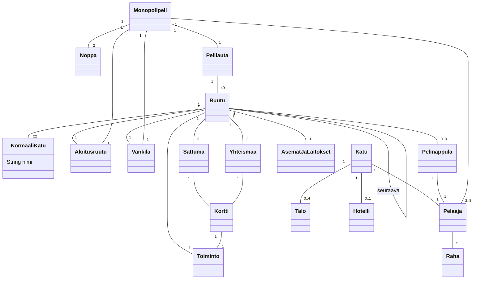

## Monopoli luokkakaavio

```mermaid
 classDiagram
    class NormaaliKatu
    NormaaliKatu : String nimi
    Monopolipeli "1" -- "2" Noppa
    Monopolipeli "1" -- "1" Pelilauta
    Pelilauta "1" -- "40" Ruutu
    Ruutu "1" -- "1" Ruutu : seuraava
    Ruutu "1" -- "1" Aloitusruutu
    Ruutu "1" -- "1" Vankila
    Ruutu "1" -- "3" Yhteismaa
    Ruutu "1" -- "3" Sattuma
    Ruutu -- "1" Toiminto
    Kortti "1" -- "1" Toiminto
    Sattuma "*" -- Kortti
    Yhteismaa "*" -- Kortti
    Katu "*" -- "1" Pelaaja
    Katu "1" -- "0..4" Talo
    Katu "1" -- "0..1" Hotelli
    Ruutu "1" -- "1" AsematJaLaitokset
    Ruutu "1" -- "22" NormaaliKatu
    Ruutu "1" -- "0..8" Pelinappula
    Monopolipeli "1" -- "1" Aloitusruutu 
    Monopolipeli "1" -- "1" Vankila 
    Pelinappula "1" -- "1" Pelaaja
    Pelaaja "2..8" -- "1" Monopolipeli
    Pelaaja -- "*" Raha
```